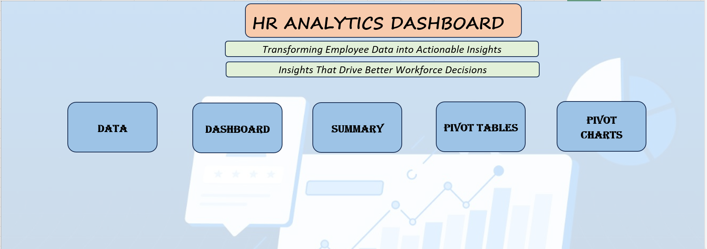
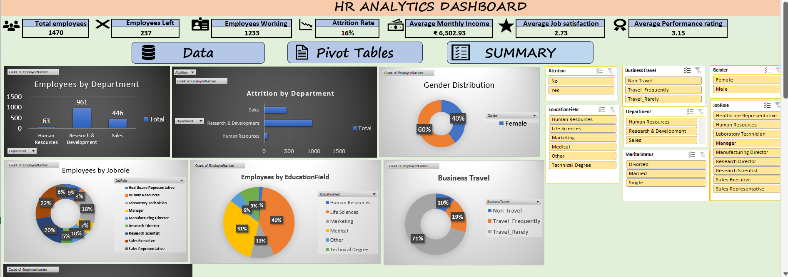
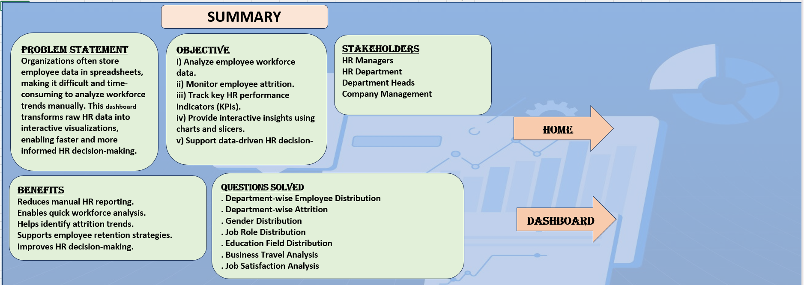

# 📊 HR Analytics Dashboard

An interactive HR Analytics Dashboard built in Microsoft Excel using the IBM HR Analytics dataset. The dashboard transforms raw employee data into meaningful insights through KPI cards, Pivot Tables, Pivot Charts, and Slicers, helping HR teams make data-driven decisions.

## 📌 Problem Statement
Organizations often manage employee data in spreadsheets, making it difficult to analyze workforce trends. This dashboard provides an interactive solution to monitor employee performance, attrition, and workforce distribution.

## 🎯 Objectives
- Analyze employee workforce data
- Monitor employee attrition
- Track HR KPIs
- Enable interactive filtering using slicers
- Support HR decision-making

## 📈 KPIs
- Total Employees
- Employees Left
- Employees Working
- Attrition Rate
- Average Monthly Income
- Average Job Satisfaction
- Average Performance Rating

## 📊 Dashboard Visualizations
- Employees by Department
- Attrition by Department
- Gender Distribution
- Employees by Job Role
- Employees by Education Field
- Business Travel Analysis
- Job Satisfaction Analysis

## 🛠 Tools Used
- Microsoft Excel
- Pivot Tables
- Pivot Charts
- Slicers
- Conditional Formatting
- Excel Formulas

## 📂 Dataset
IBM HR Analytics Employee Attrition Dataset

## 📸 Project Screenshots

### Home Page

### Dashboard

### Summary

## 💡 Key Insights
- Workforce distribution across departments
- Employee attrition analysis
- Gender distribution
- Job role analysis
- Education field distribution
- Business travel trends
- Job satisfaction insights

## 👩‍💻 Author
**Sandhya Baddam**
